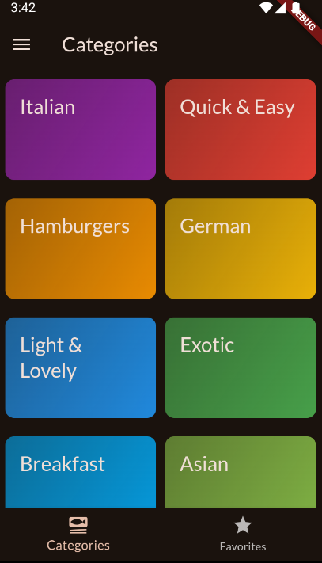
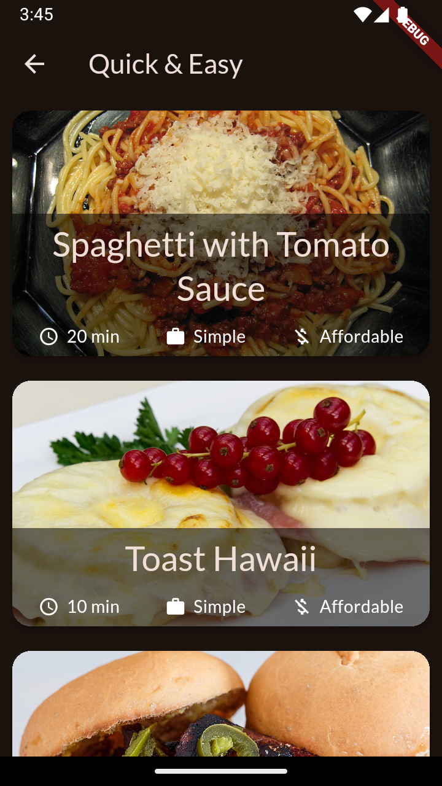
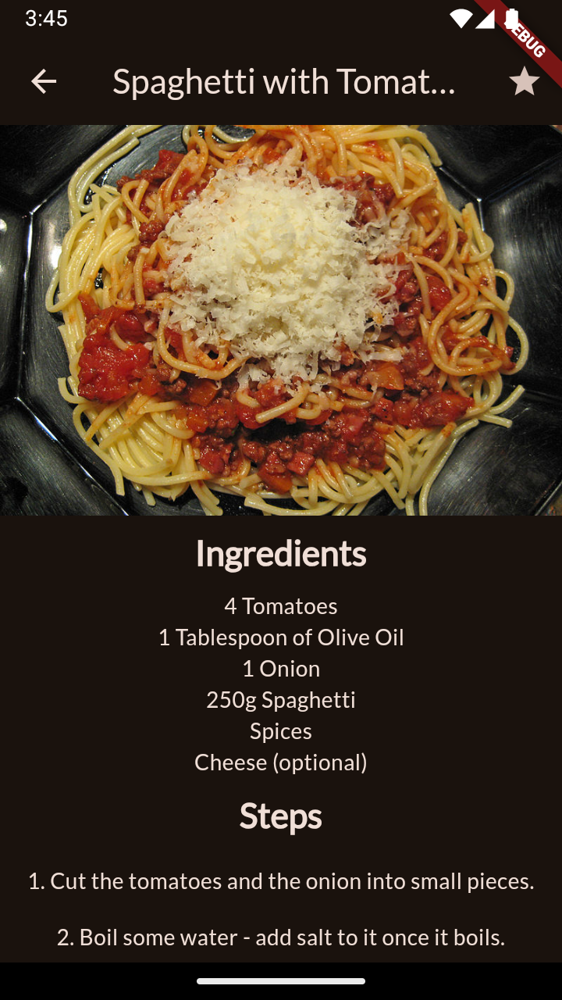
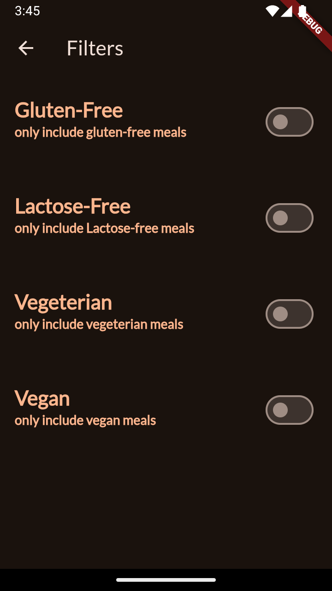
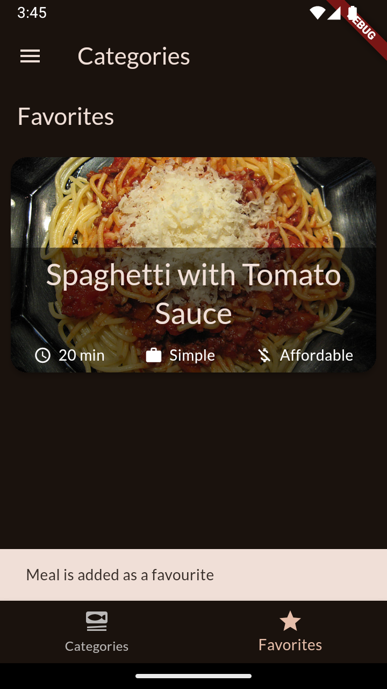

# Meals App

Meals App is a Flutter application that helps users discover and manage recipes. The app allows users to browse through a variety of meals, view detailed recipes, and save their favorite meals.

## Features

- Browse meals by categories
- View detailed recipes with ingredients and steps
- Mark meals as favorites
- Filter meals by dietary preferences (e.g., gluten-free, vegan, etc.)
- **Animations**: Smooth and engaging animations to enhance user experience
- **State Management**: Uses Riverpod for efficient and scalable state management

## Getting Started

To get started with this project, follow these steps:

### Prerequisites

- Flutter SDK: [Install Flutter](https://flutter.dev/docs/get-started/install)
- Dart SDK: Included with Flutter
- An IDE with Flutter support (e.g., Visual Studio Code, Android Studio)

### Installation

1. Clone the repository:
    ```sh
    git clone https://github.com/your-username/meals_app.git
    ```
2. Navigate to the project directory:
    ```sh
    cd meals_app
    ```
3. Install dependencies:
    ```sh
    flutter pub get
    ```

### Running the App

1. Connect a device or start an emulator.
2. Run the app:
    ```sh
    flutter run
    ```

## Project Structure

- `lib/`: Contains the main source code for the application.
  - `main.dart`: The entry point of the application.
  - `models/`: Contains data models used in the app.
  - `screens/`: Contains the different screens of the app.
  - `widgets/`: Contains reusable widgets used across the app.
  - `data/`: Contains static data used in the app.
  - `helpers/`: Contains helper functions and utilities.
  - `providers/`: Contains Riverpod providers for state management.

- `assets/`: Contains images and other assets.
- `test/`: Contains unit and widget tests.

## Screenshots

Here are some screenshots of the app:

### Home Screen

*The home screen displays a list of meal categories that users can browse.*

### Meal Categories

*This screen shows meals under the "Quick & Easy" category, allowing users to select a meal for more details.*

### Meal Details

*The meal details screen provides a detailed recipe, including ingredients and steps to prepare the meal.*

### Filters

*The filters screen allows users to filter meals based on dietary preferences such as gluten-free, vegan, etc.*

### Favourites

*The favourites screen displays meals that the user has marked as favourites for quick access.*

## Contributing

Contributions are welcome! Please follow these steps to contribute:

1. Fork the repository.
2. Create a new branch:
    ```sh
    git checkout -b feature/your-feature-name
    ```
3. Make your changes and commit them:
    ```sh
    git commit -m 'Add some feature'
    ```
4. Push to the branch:
    ```sh
    git push origin feature/your-feature-name
    ```
5. Open a pull request.

## License

This project is licensed under the MIT License - see the [LICENSE](LICENSE) file for details.

## Resources

- [Flutter Documentation](https://docs.flutter.dev/)
- [Dart Documentation](https://dart.dev/guides)
- [Flutter Cookbook](https://docs.flutter.dev/cookbook)
- [Riverpod Documentation](https://riverpod.dev/docs/getting_started)

For further assistance, feel free to open an issue or contact the maintainers.

Happy coding!